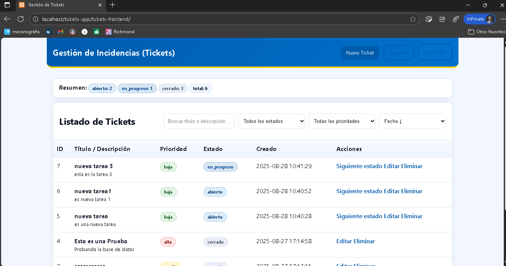
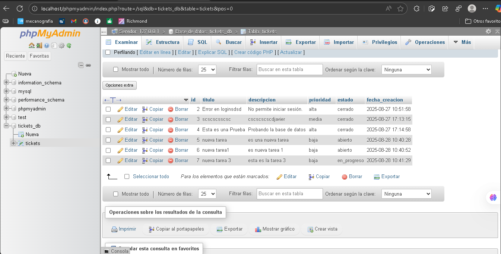

-- Módulo de Gestión de Incidencias (Tickets App)--

Este proyecto es un módulo simplificado de gestión de incidencias (tickets) desarrollado con PHP, MySQL y JavaScript.
Permite crear, listar, editar, eliminar y actualizar el estado de los tickets siguiendo el flujo:
abierto → en_progreso → cerrado.

-- Requisitos --

XAMPP https://www.apachefriends.org/es/download.html?utm_source= (Apache, PHP ≥ 8.0, MySQL ≥ 5.7)

Navegador moderno (Edge, Chrome, Firefox)

Git para control de versiones

-- Instalación --

Clona o descarga este repositorio en tu carpeta htdocs de XAMPP:

git clone https://github.com/javivas1/tickets-app.git

-- Estructura: --

C:\xampp\htdocs\tickets-app\
├── tickets-frontend\
└── tickets-backend\

-- Crea la base de datos en MySQL: --

CREATE DATABASE tickets_db CHARACTER SET utf8mb4 COLLATE utf8mb4_general_ci;
USE tickets_db;

CREATE TABLE tickets (
  id INT AUTO_INCREMENT PRIMARY KEY,
  titulo VARCHAR(120) NOT NULL,
  descripcion TEXT NOT NULL,
  prioridad ENUM('baja','media','alta') NOT NULL,
  estado ENUM('abierto','en_progreso','cerrado') DEFAULT 'abierto',
  fecha_creacion TIMESTAMP DEFAULT CURRENT_TIMESTAMP
);

-- Configura db.php en tickets-backend/: --

<?php
$conn = new mysqli("localhost", "root", "", "tickets_db");
if($conn->connect_error){
  die(json_encode(["error"=>"DB error: ".$conn->connect_error]));
}
?>

-- inicia Apache y MySQL desde el panel de XAMPP. --

Abre en el navegador:

Frontend: http://localhost/tickets-app/tickets-frontend/

Backend (ejemplo endpoint): http://localhost/tickets-app/tickets-backend/get_tickets.php

-- API – Endpoints disponibles --

1. Crear ticket 

*POST /tickets-backend/insert_ticket.php*

{
  "titulo": "Error en login",
  "descripcion": "No permite iniciar sesión",
  "prioridad": "alta"
}

2. Listar tickets

*GET /tickets-backend/get_tickets.php*

3. Editar ticket

*POST /tickets-backend/update_ticket.php*

{
  "id": 1,
  "titulo": "Nuevo título",
  "descripcion": "Descripción actualizada",
  "prioridad": "media"
}

4. Actualizar estado

*POST /tickets-backend/patch_estado.php*

{
  "id": 1
}

*Avanza de abierto → en_progreso → cerrado.*

5. Eliminar ticket

*POST /tickets-backend/delete_ticket.php*

{
  "id": 1
}

-- Interfaz de usuario --

Listado de tickets con título, prioridad, estado, fecha y acciones.

Formulario de creación/edición con validaciones:

Título mínimo 5 caracteres.

Descripción mínimo 10 caracteres.

Prioridad: baja | media | alta.

Botón Siguiente estado para avanzar en el flujo.

Botón Eliminar para borrar ticket.

-- Buenas prácticas aplicadas --

Separación Frontend/Backend: HTML+CSS+JS por un lado, API en PHP/MySQL por otro.

Validaciones en 2 capas: en JS (cliente) y en PHP (servidor).

Mensajes claros de error/success en JSON.

Principio de responsabilidad única (SRP): cada archivo PHP cumple una función específica.

Uso de Git: historial de cambios y ramas de prueba posibles.

Ejemplo de uso con cURL
# Crear ticket
curl -X POST http://localhost/tickets-app/tickets-backend/insert_ticket.php \
  -H "Content-Type: application/json" \
  -d "{\"titulo\":\"Error\",\"descripcion\":\"Falla al guardar\",\"prioridad\":\"alta\"}"

# Listar tickets
curl http://localhost/tickets-app/tickets-backend/get_tickets.php

# Actualizar estado
curl -X POST http://localhost/tickets-app/tickets-backend/patch_estado.php \
  -H "Content-Type: application/json" \
  -d "{\"id\":1}"

## 📸 Vista previa

